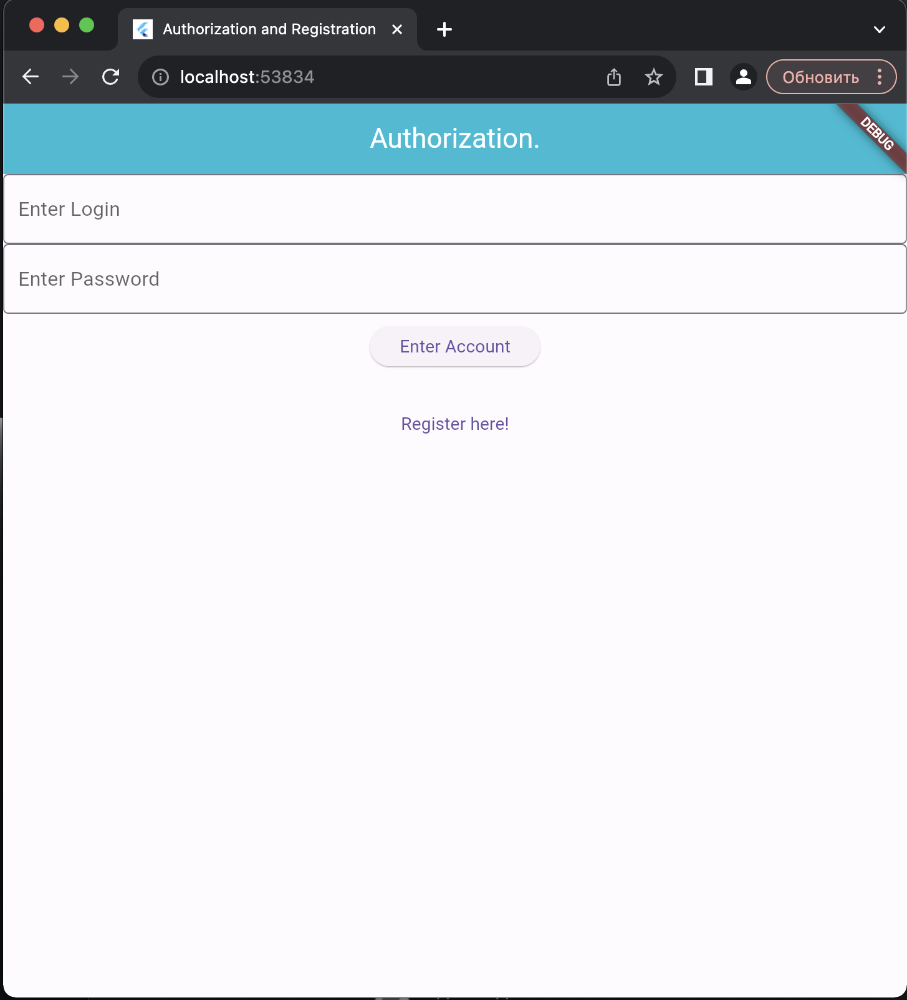
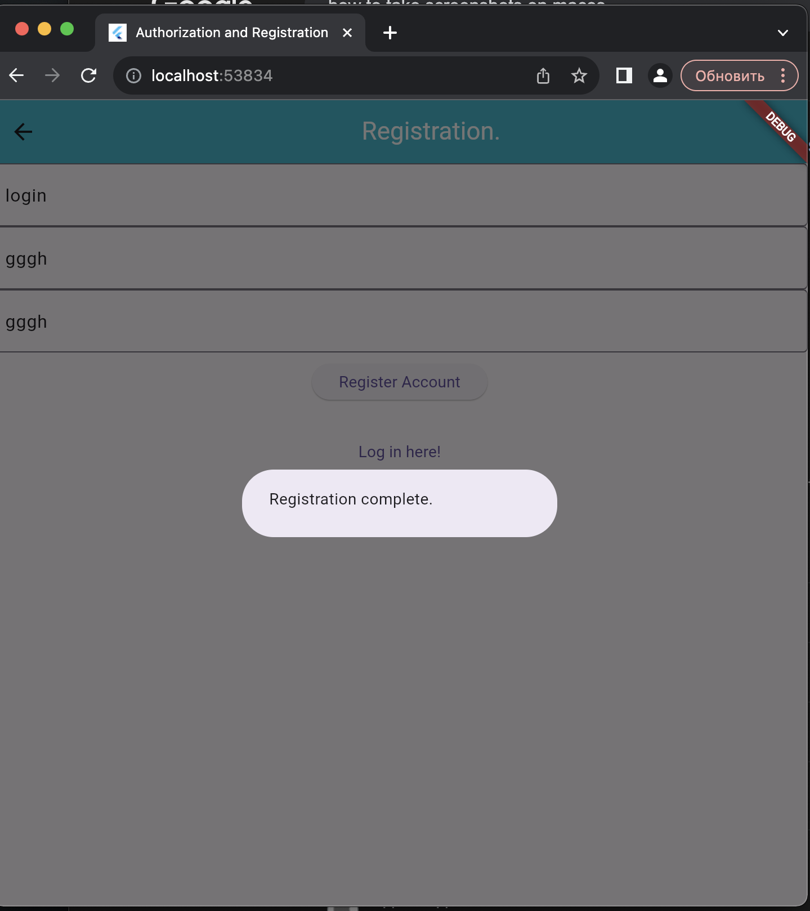
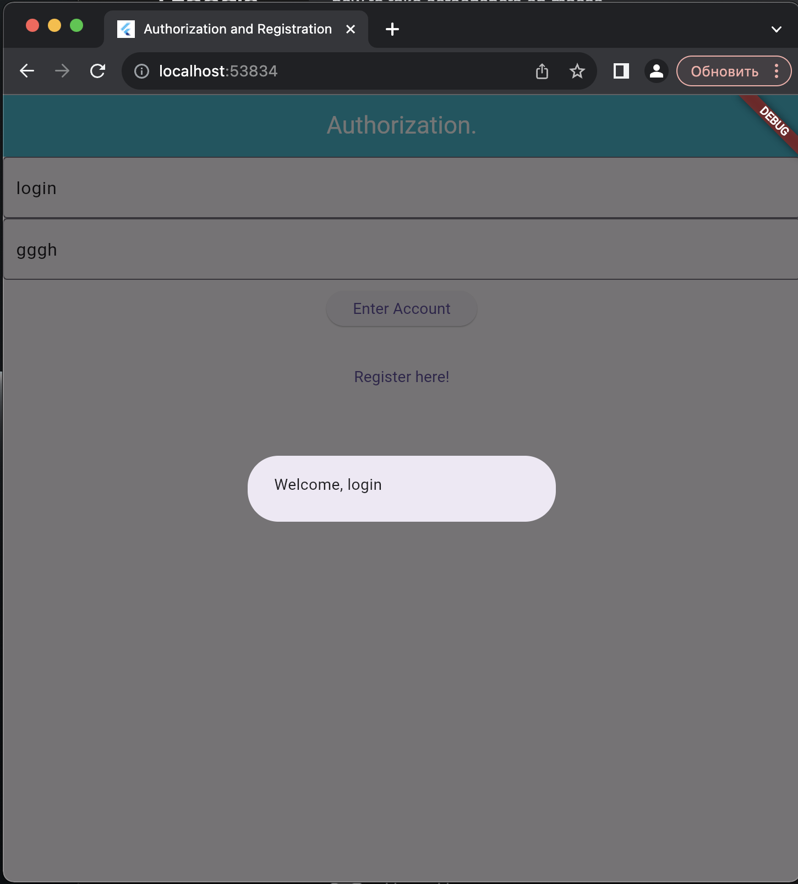
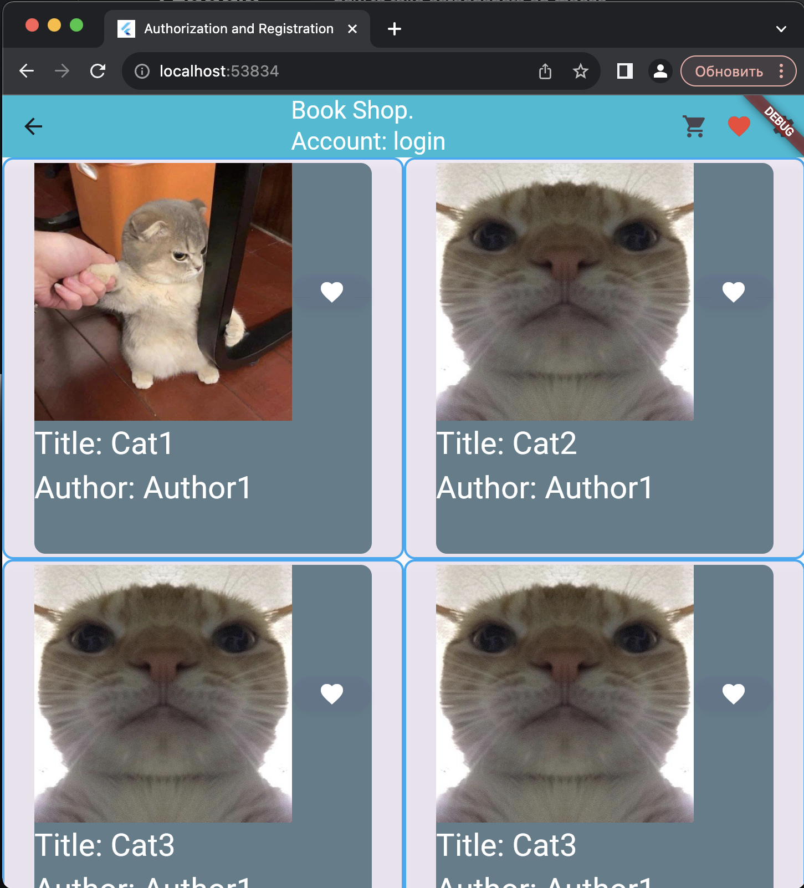
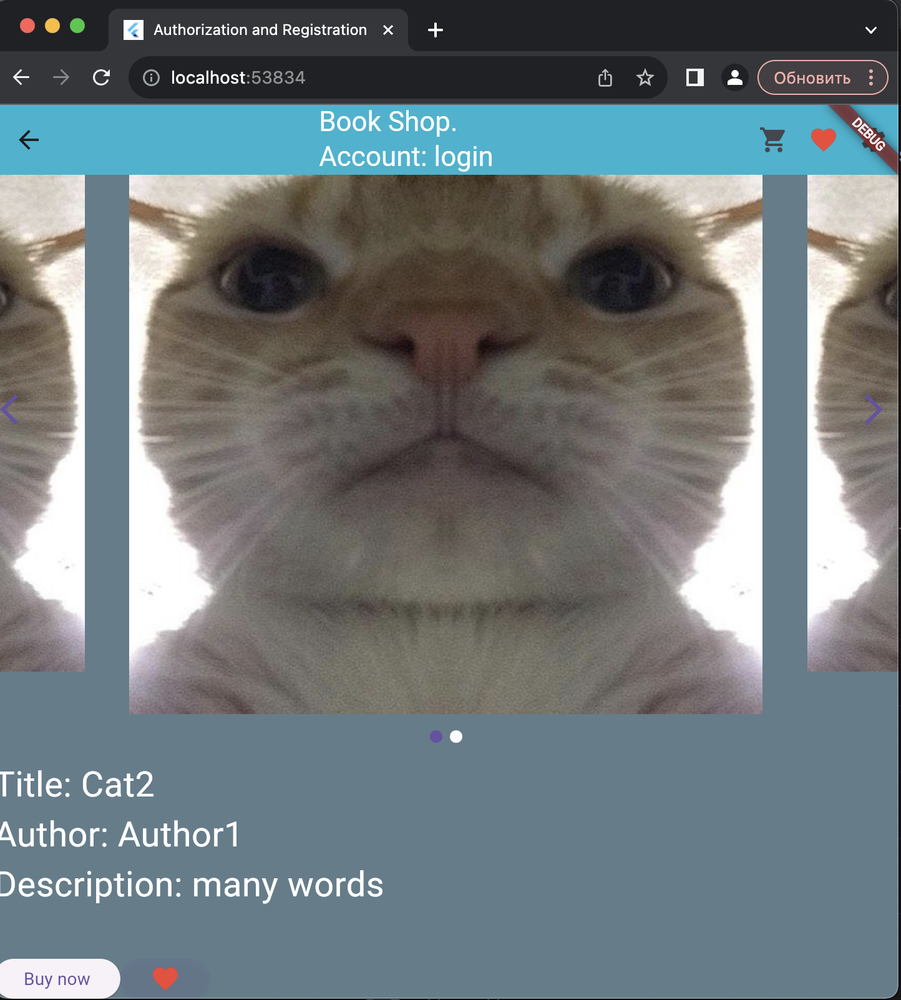

# Book Shop (without books for now).

A Flutter Project with Authorization, Registration, Shop page and individual books pages, also with shopping cart and favorites.

## Authorization window.
The Home window. Has TextFields for Login and Password, a button to enter account and a button to go to a registration window.

You CANNOT enter the account before registrating it. 
You MUST enter the correct login AND password after registrating the account.

This is how it looks.

## Registration window.
Can be accessed by pressing the registration button on the authorization window. Has a few TextFields for login and password (and confirm password), a button to register and a button to go to a logging in window.

A button to login is DISABLED until you register an account. 
An account is registered ONLY when you enter a login, a password (and confirm it) and press the button to registrate the account. Then, the login button is enabled and you can go back to authorization window.

This is how it looks.

## Back to the Authorization window.

When you enter the correct login and password and press login button, you are greet with a welcoming message and you need to press it again to enter the shop.

This is how it looks.

## Shop page.

There's an appBar on top with a 'Book shop' text, your account name, and icons of shopping cart, favorite and settings (settings icon is just so the other icons aren't hidden behind DEBUG flair)

On the page, there are multiple books (which are buttons) with image, favorite button (pressing it will make icon red if it was white and vice versa), title and author.

Pressing on the book will take you to the book's page

This is how it looks.

## 'Book' page

Appbar is the same. 
Most information is the same, but there's also description, multiple images in a swipe function, and a button to buy the book.

This is how it looks.

